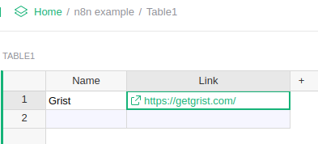
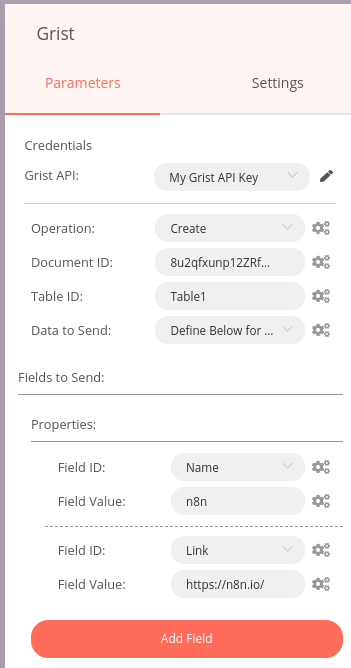
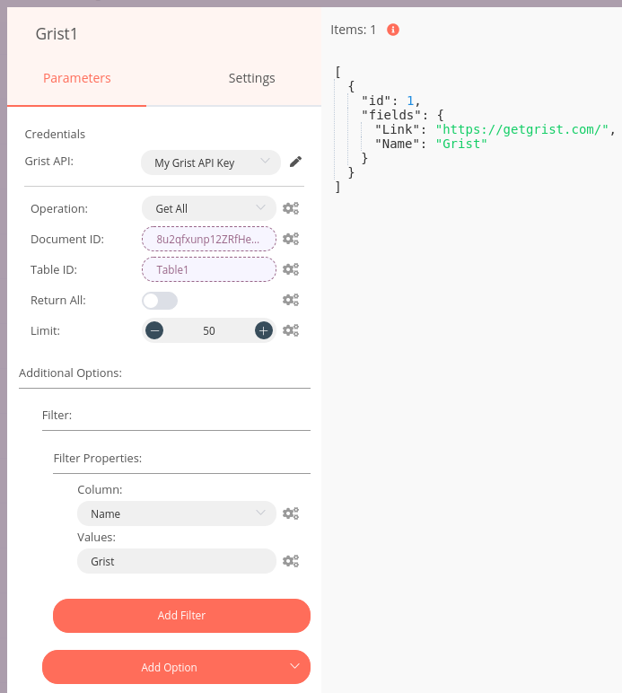
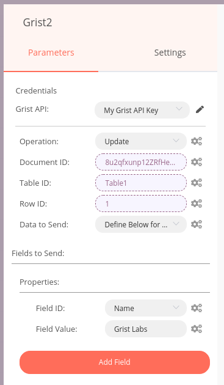
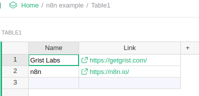

# Grist

[Grist](https://getgrist.com/) combines the flexibility of a spreadsheet with the robustness of a database to organize your data, your way.

::: tip 🔑 Credentials
You can find authentication information for this node [here](../../../credentials/Grist/README.md).
:::

## Basic Operations

<Resource node="n8n-nodes-base.grist" />

## Example Usage

This workflow allows you to insert and update data from a table in Grist. You can also find the [workflow](https://n8n.io/workflows/818) on n8n.io. This example usage workflow would use the following nodes.
- [Start](../../core-nodes/Start/README.md)
- [Grist]()

The final workflow should look like the following image.

### 1. Start node

The start node exists by default when you create a new workflow.

### 2. Grist node (Create)

This node will create a new record in a table. Create a document with a table like [this](https://docs.getgrist.com/8u2qfxunp12Z/n8n-example/m/fork) in your Grist workspace:

1. First of all, you'll have to enter credentials for the Grist node. You can find out how to do that [here](../../../credentials/Grist/README.md).
2. Select 'Create' from the ***Operation*** dropdown list.
3. In your document, click your profile icon, then Document Settings, then copy the value under "This document's ID". Paste that into the ***Document ID*** field in your Grist node in n8n.
4. Enter the ID of your table in the ***Table ID*** field. This is the identifier used to refer to the table in formulas and may be slightly different from the label seen in the sidebar. If in doubt, look at the Code View.
5. Under ***Fields to Send*** click the ***Add Field*** button twice.
6. For the first field, choose `Name` from the ***Field ID*** dropdown, and type a name in the ***Field Value***.
7. For the second field, choose `Link` from the ***Field ID*** dropdown, and enter a URL in the ***Field Value***.
8. Click on ***Execute Node*** to run the node.

Here is an example of how the configuration should look:

And here's the result of adding the record to the Grist table:

### 3. Grist1 node (Get All)

This node will list all the records with a particular `Name` value.
::: v-pre
1. Select the credentials that you entered in the previous node.
2. Select the 'Get All' option from the ***Operation*** dropdown list.
3. Click on the gears icon next to the ***Document ID*** field and click on ***Add Expression***.
4. Select the following in the ***Variable Selector*** section: Nodes > Grist > Parameters > docId. You can also add the following expression: `{{$node["Grist"].parameter["docId"]}}`.
5. Click on the gears icon next to the ***Table*** field and click on ***Add Expression***.
6. Select the following in the ***Variable Selector*** section: Nodes > Grist > Parameters > tableId. You can also add the following expression: `{{$node["Grist"].parameter["tableId"]}}`.
7. Click on ***Add Option*** and select 'Filter' from the dropdown list.
8. Click the ***Add Filter*** button.
9. Select `Name` from the **Column** dropdown.
10. Type a name in the ***Values*** field.
11. Click on ***Execute Node*** to run the node.
:::
In the screenshot below, the node only returned the record with the name 'Grist'.

### 4. Grist2 node (Update)

This node will update the Name field of the record that we received from the previous Grist node.
::: v-pre
1. Select the Grist1 node in your workflow and click the 'Duplicate Node' just above. This way we don't need to specify the credentials, Document ID, and Table ID again.
2. Double click the newly duplicated node (Grist2) to edit it.
3. Select 'Update' from the ***Operation*** dropdown list.
4. Click on the gears icon next to the ***Row ID*** field and click on ***Add Expression***.
5. Select the following in the ***Variable Selector*** section: Nodes > Grist1 > Output Data > JSON > id. You can also add the following expression: `{{$node["Grist1"].json["id"]}}`.
6. Under ***Fields to Send*** click the ***Add Field*** button once.
7. Choose `Name` from the ***Field ID*** dropdown, and type a name in the ***Field Value***.
8. Click on ***Execute Node*** to run the node.
:::
Here is an example of how the configuration should look:

The result is that the Name in the first record changed from 'Grist' to 'Grist Labs':

## FAQs

### How to get the Row ID?

To update or delete a particular record, you need the Row ID. There are two ways to get the Row ID.

**Create a Row ID column in Grist**

Create a new column in your Grist table with the formula `$id`.

**Use the Get All operation**

The ***Get All*** operation returns the Row ID of each record along with the fields. You can obtain it with the expression `{{$node["GristNodeName"].json["id"]}}`.

### How to filter records when using the Get All operation?

- Click on ***Add Option*** and select 'Filter' from the dropdown list.
- You can add filters for any number of columns. The result will only include records which match all the columns.
- For each column, you can enter any number of values separated by commas. The result will include records which match any of the values for that column.
